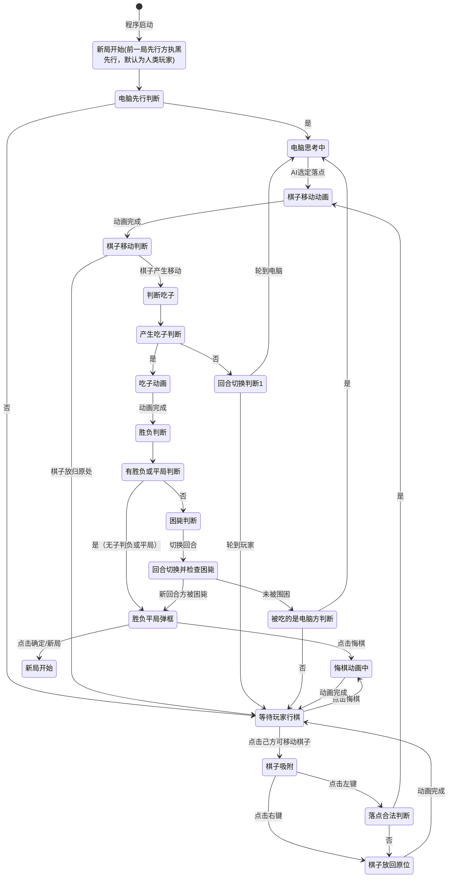

# 「六子冲」游戏状态流转图

## 状态流转图



## 状态详细说明

| 状态名                 | 说明                                           |
| ---------------------- | ---------------------------------------------- |
| **新局开始**     | 初始化棋盘，决定先行方                         |
| **电脑思考中**   | AI计算行棋方案，玩家不可操作任何UI             |
| **等待玩家行棋** | 玩家可操作UI，可点击棋子或悔棋                 |
| **棋子吸附**     | 棋子跟随鼠标移动，显示原始位置标记，不可操作UI |
| **棋子移动动画** | 棋子以动画方式移动到目标位置                   |
| **判断吃子**     | 程序判断当前行棋是否产生吃子                   |
| **吃子动画**     | 被吃棋子闪烁、消失并播放音效                   |
| **胜负判断**     | 判断是否出现胜负、平局或困毙                   |
| **胜负平局弹框** | 显示结果对话框，提供悔棋/新局选项              |
| **悔棋动画中**   | 棋子以动画方式回退，被吃棋子恢复               |

### 胜负判断详细流程

```
胜负判断(CheckingGameEnd)
    │
    ├─> 检查无子判负（双方都要检查）
    │   ├─> 某方无子 → 对方获胜
    │   └─> 都有子 → 继续
    │
    ├─> 检查平局（双方均≤2子）
    │   ├─> 是 → 平局
    │   └─> 否 → 继续
    │
    ├─> 检查困毙（current_turn方）
    │   ├─> 被困毙 → 对方获胜
    │   └─> 否 → 切换回合
    │
    └─> 切换回合后再次检查困毙（新的current_turn方）
        ├─> 被困毙 → 对方获胜
        └─> 否 → 继续下一回合
```

## 判断节点说明

| 判断节点                     | 说明                                       |
| ---------------------------- | ------------------------------------------ |
| **电脑先行判断**       | 本局是否由电脑执黑先行                     |
| **落点合法判断**       | 玩家落点是否合法（空位且符合规则，或原位） |
| **棋子移动判断**       | 棋子是否产生了实际移动（非放回原位）       |
| **产生吃子判断**       | 当前行棋是否产生吃子                       |
| **有胜负或平局判断**   | 当前局面是否已分出胜负或平局（无子判负）   |
| **困毙判断**           | 检查当前行棋方是否被困毙                   |
| **回合切换并检查困毙** | 切换回合后检查新回合方是否被困毙           |
| **回合切换判断1**      | 根据当前行棋方决定下一回合                 |
| **被吃的是电脑方判断** | 被吃的子是否属于电脑方（用于吃子后的判断） |

## 困毙判断说明

困毙是指某一方棋子仍有剩余，但所有棋子都被围困无法移动的情况。判断时机：

1. **常规困毙判断**：在 `胜负判断` 状态时，先检查 `current_turn`（当前行棋方）是否被困毙
2. **切换后困毙判断**：如果常规检查无结果，则切换回合，再检查新的 `current_turn` 是否被困毙

### 为什么需要两次判断？

因为当AI行棋后，`current_turn` 仍然是AI方，此时需要：
1. 先检查AI方是否因行棋导致自己被围困（如担子自杀）
2. 再检查人类方是否被AI围困无法移动

这样就能正确处理**人类玩家被AI困毙**的情况。
