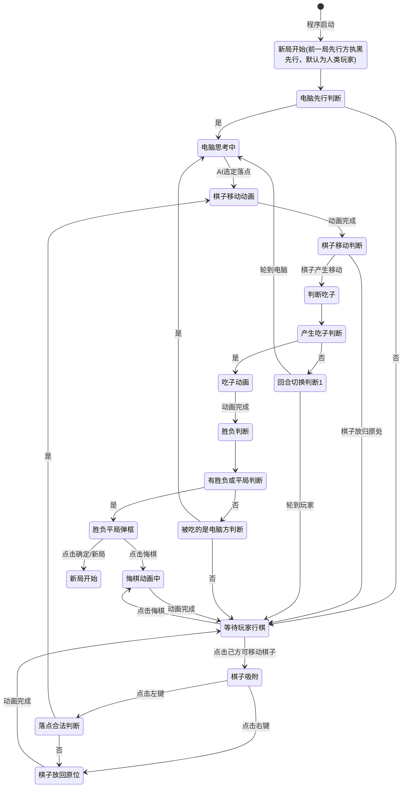

# 「六子冲」游戏状态流转图

## 状态流转图

## 状态详细说明

| 状态名                 | 说明                                           |
| ---------------------- | ---------------------------------------------- |
| **新局开始**     | 初始化棋盘，决定先行方                         |
| **电脑思考中**   | AI计算行棋方案，玩家不可操作任何UI             |
| **等待玩家行棋** | 玩家可操作UI，可点击棋子或悔棋                 |
| **棋子吸附**     | 棋子跟随鼠标移动，显示原始位置标记，不可操作UI |
| **棋子移动动画** | 棋子以动画方式移动到目标位置                   |
| **判断吃子**     | 程序判断当前行棋是否产生吃子                   |
| **吃子动画**     | 被吃棋子闪烁、消失并播放音效                   |
| **胜负判断**     | 判断是否出现胜负或平局                         |
| **胜负平局弹框** | 显示结果对话框，提供悔棋/新局选项              |
| **悔棋动画中**   | 棋子以动画方式回退，被吃棋子恢复               |

## 判断节点说明

| 判断节点                     | 说明                                       |
| ---------------------------- | ------------------------------------------ |
| **电脑先行判断**       | 本局是否由电脑执黑先行                     |
| **落点合法判断**       | 玩家落点是否合法（空位且符合规则，或原位） |
| **棋子移动判断**       | 棋子是否产生了实际移动（非放回原位）       |
| **产生吃子判断**       | 当前行棋是否产生吃子                       |
| **有胜负或平局判断**   | 当前局面是否已分出胜负或平局               |
| **回合切换判断1**      | 根据当前行棋方决定下一回合                 |
| **被吃的是电脑方判断** | 被吃的子是否属于电脑方（用于吃子后的判断） |
